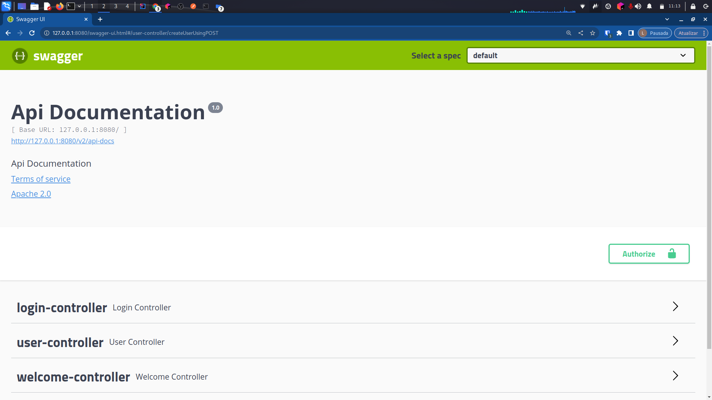
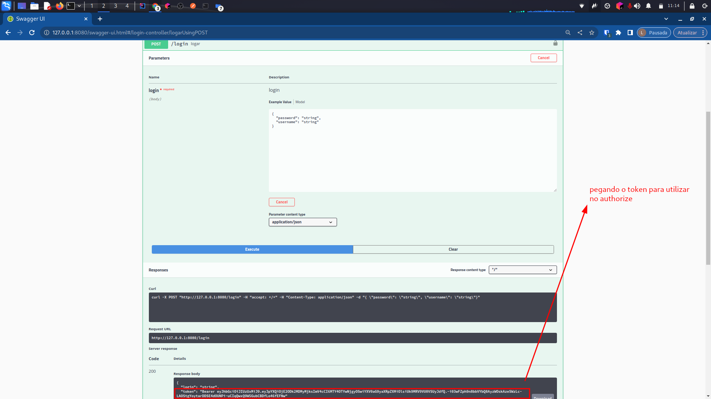
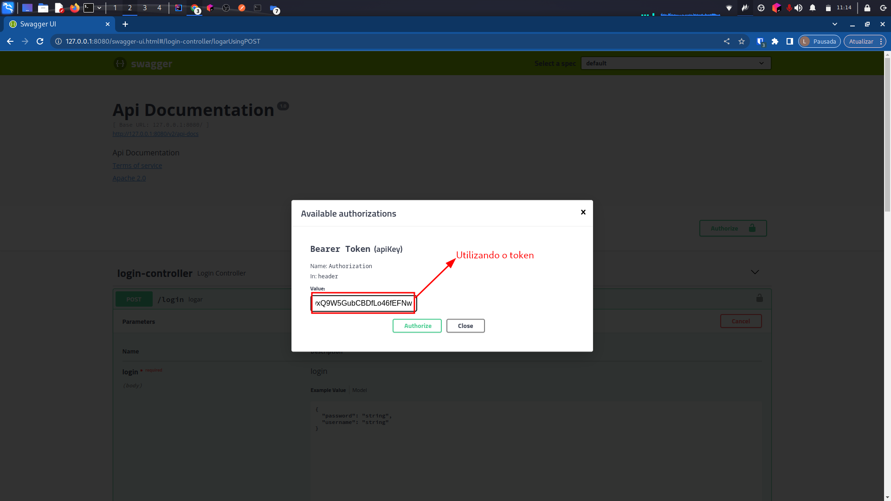
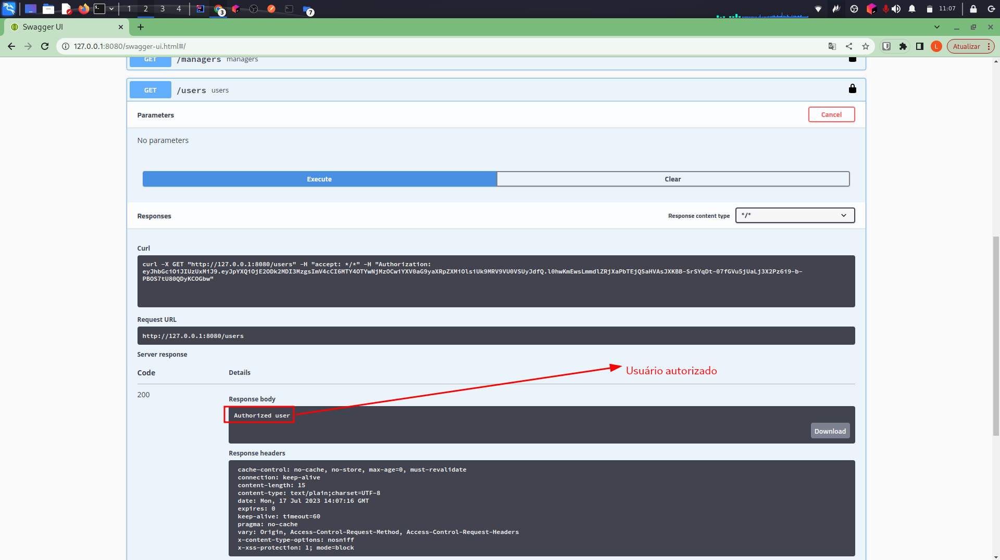

# Projeto de Autenticação com JWT e Swagger

Este projeto é um exemplo de uma aplicação Java usando o framework Spring Boot, que implementa autenticação via JWT (JSON Web Token) e utiliza o Swagger para documentar a API.

## Descrição

O objetivo deste projeto é demonstrar a implementação de um sistema de autenticação seguro utilizando tokens JWT e a documentação da API com Swagger. Esta aplicação foi desenvolvida com o intuito de ser um projeto educativo e de aprendizado. É importante ressaltar que, para utilização em um cenário real de produção, é recomendado seguir boas práticas de segurança, realizar testes adequados e revisar o código em busca de possíveis vulnerabilidades.


Este projeto é adequado para fins educacionais e pode servir como um ponto de partida para desenvolvedores que desejam aprender sobre autenticação com JWT e a integração do Swagger em aplicações Spring Boot.


## Instruções de Instalação

1. Certifique-se de ter o Java e o Maven instalados em sua máquina.

2. Clone este repositório para o seu ambiente local.

3. Navegue até o diretório raiz do projeto.

4. Execute o seguinte comando para construir o projeto e gerar o pacote executável:

   ```bash
   mvn package
   ```

5. Após a conclusão do comando acima, você pode executar o aplicativo com o seguinte comando:

   ```bash
   java -jar target/nome-do-arquivo.jar
   ```

6. O aplicativo estará em execução e você poderá acessá-lo no endereço `http://localhost:8080`.


## Telas do Swagger

A seguir, estão algumas capturas de tela do Swagger, demonstrando a utilização da API com autenticação via JWT.

1. **Tela Inicial do Swagger:**



2. **Realizando o POST /login para obter o token:**



3. **Utilizando o token obtido no cabeçalho "Authorize" do Swagger:**



4. **Usuário Autorizado acessando o GET /users:**



*Observação:* As imagens acima são meramente ilustrativas e foram criadas para fins de demonstração do fluxo de autenticação com JWT no Swagger. Em um cenário real, os detalhes do projeto e do ambiente podem variar.

## Como Usar a API

### Autenticação

- Antes de utilizar os endpoints protegidos pela autenticação, você precisa autenticar-se e obter um token JWT válido.

- Para isso, faça uma requisição POST para `/auth/login` com o corpo (body) contendo as credenciais do usuário (username e password).

- Exemplo de requisição:

   ```http
   POST /login
   Content-Type: application/json

   {
     "username": "seu_usuario",
     "password": "sua_senha"
   }
   ```

- A resposta será um token JWT válido que você deve utilizar nas requisições subsequentes.

### Endpoints da API

- Todos os endpoints protegidos requerem a inclusão do token JWT na seção "Authorize" do Swagger.

- Para incluir o token JWT, clique no botão "Authorize" e digite "Bearer {seu_token}".

### Exemplo de Requisição

- Vamos criar um novo usuário utilizando o endpoint POST `/users`.

- Abra o Swagger (`http://localhost:8080/swagger-ui.html`) e clique em "Authorize".

- Insira o token JWT recebido após a autenticação (sem as chaves "{}") e clique em "Authorize".

- Agora você está autorizado a fazer requisições protegidas.

- Vá para o endpoint GET `/users` e clique em "Try it out".

- Se você tiver permissão para visualizar a resposta será exibida na seção "Response Body".


## Tecnologias Utilizadas

- Java
- Spring Boot
- Spring Security
- JSON Web Token (JWT)
- Swagger

## Contribuição

Contribuições são bem-vindas! Se você quiser contribuir com o projeto, siga os seguintes passos:

1. Faça um fork deste repositório.

2. Crie um branch para a sua feature ou correção de bug:

   ```bash
   git checkout -b minha-feature
   ```

3. Faça as alterações desejadas e faça um commit:

   ```bash
   git commit -m "Minha feature incrível"
   ```

4. Envie o branch para o seu repositório remoto:

   ```bash
   git push origin minha-feature
   ```

5. Abra um Pull Request para este repositório original.

## Licença

Este projeto está licenciado sob a [MIT License](LICENSE). Sinta-se livre para usá-lo da forma que preferir.
